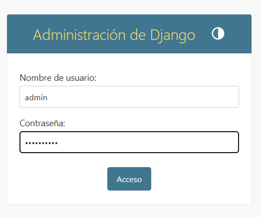
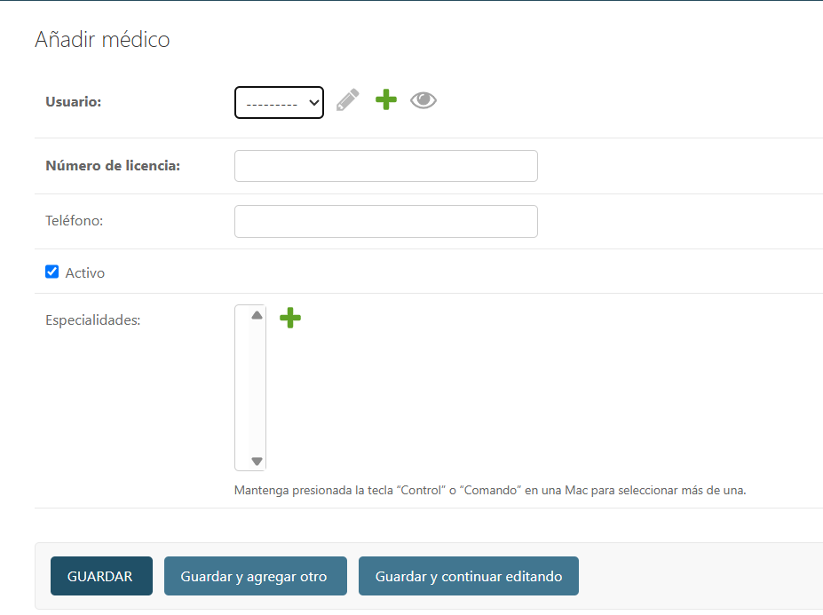
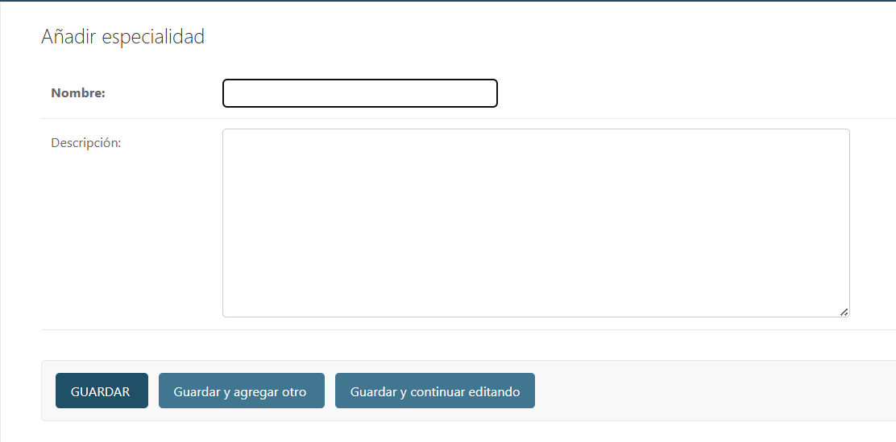
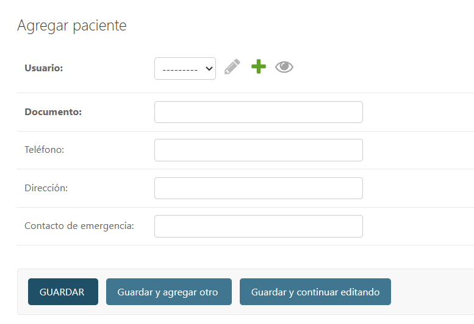
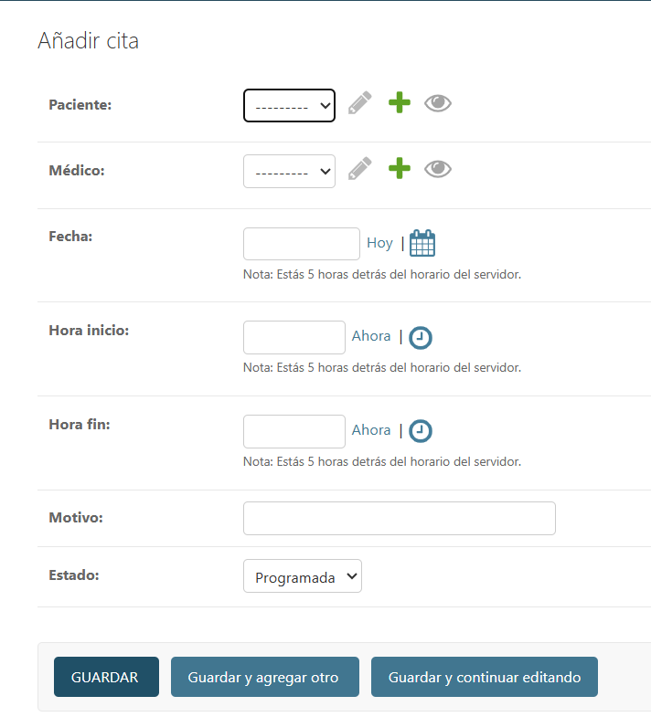
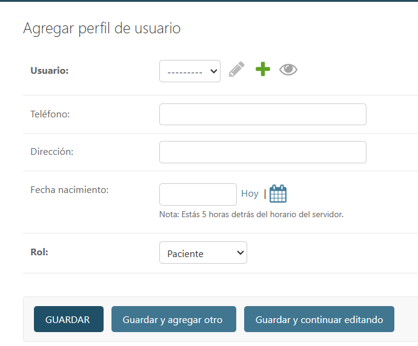

echo # Gestor de Citas Médicas en Django > README.md

Gestor de Citas Médicas
 Descripción general

El Gestor de Citas Médicas es un sistema desarrollado con el framework Django que permite administrar la programación de citas médicas, así como el registro de pacientes, médicos, especialidades y el control del historial clínico.

Requisitos técnicos

Python 3.11 

Django 5.2.7

SQLite3 

Entorno virtual: venv

Navegador web: Google Chrome, Edge o Firefox

Estructura del sistema
Aplicación                      	Descripción
cuentas	                        Maneja la autenticación y roles de usuario.
especialidades          	Define las áreas médicas disponibles.
médicos	                        Registra los datos de los médicos y sus especialidades.
pacientes	                Almacena los datos personales y médicos de los pacientes.
citas	                        Permite agendar, modificar y cancelar citas médicas.
historial_médico	        Guarda diagnósticos, observaciones y tratamientos posteriores a la cita.

Relaciones entre entidades

Un médico puede tener varias especialidades.

Un paciente puede tener varias citas.

Una cita pertenece a un paciente y a un médico.

Cada historial médico se asocia a una cita.

 Capturas del sistema

 🔐 Pantalla de inicio de sesión

 Panel principal del administrador

 Gestión de médicos

 Especialidades médicas

 Gestión de pacientes

 Administración de citas

 Historial médico del paciente

 Gestión de usuarios del sistema

Casos de uso principales
Administrador:

Registra médicos, pacientes y especialidades.

Agenda, modifica o elimina citas médicas.

Supervisa historiales médicos.

 Médico:

Visualiza sus citas programadas.

Registra diagnósticos, observaciones y tratamientos.

 Paciente:

Revisa sus citas y diagnósticos médicos.

Mantiene actualizada su información personal.

Autores

Samuel Prada 
Jafet Sardo